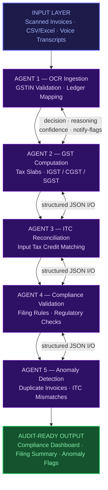
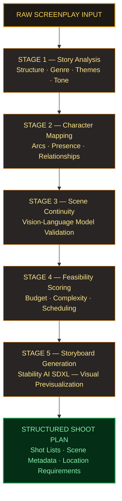
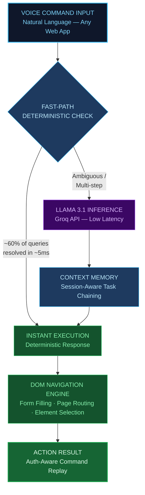
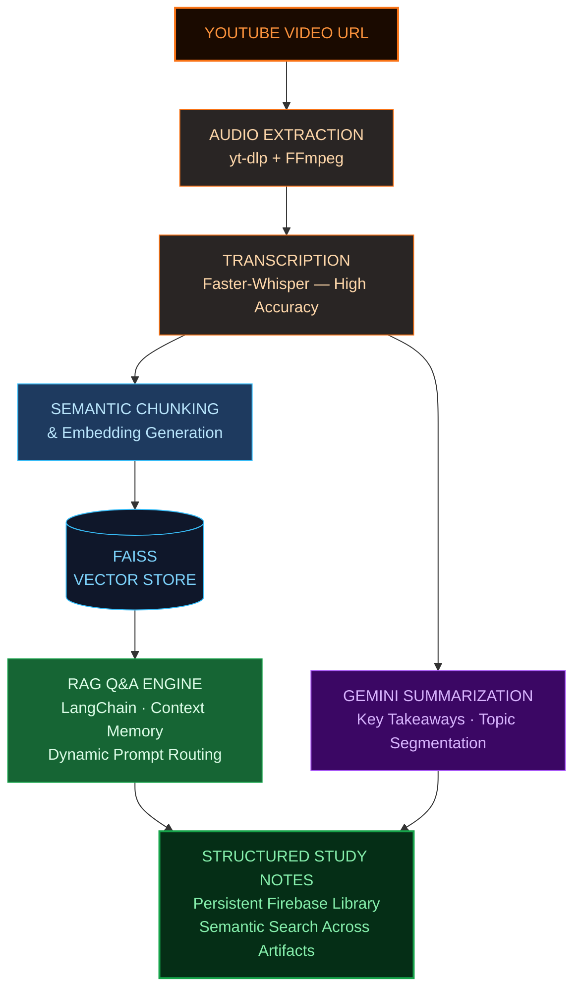
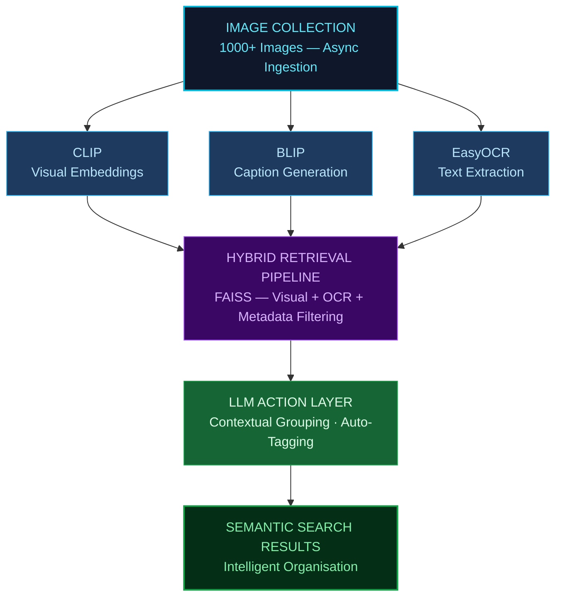

<div align="center">


</div>

<div align="center">

[](https://git.io/typing-svg)

<br/>

[](https://www.linkedin.com/in/pavan-kumar-kunukuntla-789990294)
[](mailto:pavankumarkunukuntla@gmail.com)
[](https://github.com/pavan939)
[](https://wa.me/919391118474)

<br/>


</div>

---

## 🟢 Open to Work

<div align="center">

> **Actively seeking full-time, internship, and contract roles in Agentic AI, AI Engineering, Data Science, and Backend AI Systems.**

| 🌍 Remote | 🏢 On-site | 📍 Preferred Locations |
|:---------:|:----------:|:----------------------:|
| ✅ Available | ✅ Available | Hyderabad · Bengaluru · Pan-India |

**Target Roles:** `AI Engineer` · `Agentic AI Developer` · `ML Engineer` · `Data Scientist` · `Backend AI Developer`

</div>

---

## 👤 About Me

I'm a **final-year B.Tech CSE student at RGUKT Basar** and an **Agentic AI Engineer** who builds systems that actually work — not just in notebooks, but in production pipelines with traceable reasoning, multimodal inputs, and measurable business impact.

- 🤖 Specialise in **multi-agent orchestration, RAG architectures, and multimodal AI systems**
- 🔗 Built 5+ end-to-end AI systems spanning **voice, vision, language, and data pipelines**
- 🏆 **Smart India Hackathon Winner** · **CineAI Hackathon 6th Place (All-India)**
- 🏢 Interned at **Microsoft Elevate** (AI & Data Pipelines) and **Infosys Springboard** (Python Full Stack)
- 📚 Certified in **IBM RAG & Agentic AI**, **ML Specialization**, and **Deep Learning** (DeepLearning.AI)
- 🌱 Currently exploring: **SLM fine-tuning · RL for agents · MCP protocol**

---

## 🧠 Technical Skills

### 🤖 Agentic AI & LLM Systems


### 👁️ Multimodal AI


### 🔬 Machine Learning & Data Science


### 🔧 Backend & Frameworks


### 🗄️ Databases & DevOps


### 💻 Languages


---

## 🚀 Featured Projects

### 🧾 TaxSetu — Multi-Agent GST Compliance Platform
> `Feb 2026` · Build For India, KSUM Kerala &nbsp;|&nbsp; `React` `Vite` `Gemini API` `Firebase` `Node.js` `Cloud Functions`



- 🤖 **5-agent pipeline** with structured JSON I/O (decision · reasoning · confidence · notify-flags) producing fully traceable, audit-ready workflows
- ⚡ **~70% reduction** in manual GST review effort across OCR ingestion, reconciliation, and compliance validation stages
- 🗣️ **Multilingual voice-first** accessibility layer targeting the 88% of Indian MSMEs underserved by English-only platforms
- 📥 **Multimodal ingestion** — scanned invoices, CSV/Excel, and voice transcripts with automated GSTIN validation
- 🏢 Deployed to **3+ MSME pilot users** with automated compliance summaries, dashboards, and anomaly reports

---

### 🎬 VisionSync — Agentic Film Pre-Production Platform
> `Jan 2026` · CineAI Hackathon — **6th Place, All-India** &nbsp;|&nbsp; `React` `TypeScript` `Express` `Gemini Vision` `Stability AI SDXL` `Firestore`



- 🎥 **~60% reduction** in manual storyboard review cycles via vision-language scene-level continuity evaluation
- ⏱️ Compressed **screenplay-to-production-plan** from days to minutes by automating 6 manual pre-production stages in a single pipeline
- 📋 Produced structured breakdowns: shot lists · scene metadata · character presence maps · budget estimates · location requirements
- 🖼️ Generated **AI storyboard visuals** directly from screenplay text using Stability AI SDXL

---

### 🎙️ Nina — AI Voice Navigation SDK
> `2025` &nbsp;|&nbsp; `TypeScript SDK` `FastAPI` `Groq API` `Llama 3.1` `Supabase`



- 🔌 **Single script-tag SDK** — voice-enables any web app with zero configuration required
- ⚡ Hybrid inference: **deterministic fast-path (~5ms)** covers ~60% of queries; Llama 3.1 handles ambiguous multi-step commands
- 🎯 **~50% fewer user interaction steps** across 4+ web platforms
- 🔐 Multi-tenant SaaS with **SHA-256 API key hashing**, Row Level Security, and Supabase Realtime live dashboard

---

### 🎧 PodNotes — Multimodal Knowledge Extraction Platform
> `2025` &nbsp;|&nbsp; `FastAPI` `Faster-Whisper` `LangChain` `Gemini` `FAISS` `React` `TypeScript` `Firebase`



- 🔄 **End-to-end pipeline**: video → audio → transcript → embeddings → structured notes in a single automated flow
- 💬 **RAG-powered Q&A** with context memory and dynamic prompt routing via LangChain + FAISS vector search
- 📚 Firebase-backed **persistent note library** with semantic search across all saved knowledge artifacts

---

### 🖼️ AI Semantic Photo Gallery — Multimodal Image Retrieval
> `2025` &nbsp;|&nbsp; `Python` `FastAPI` `CLIP` `BLIP` `EasyOCR` `FAISS` `NumPy`



- 🔍 Semantic search across **1,000+ images** using CLIP visual embeddings + BLIP captions + EasyOCR text extraction for enriched metadata indexing
- ⚡ Async ingestion pipeline with **~40% faster** batch indexing via hybrid retrieval (visual + OCR + metadata filtering)
- 🏷️ LLM-based action layer enabling **contextual grouping, auto-tagging, and intelligent image organisation**


---

## 💼 Experience

### 🔵 AI & Data Pipeline Intern — Microsoft Elevate
`Dec 2025 – Jan 2026`

- 🏗️ Architected end-to-end **healthcare data ingestion pipeline** supporting structured + semi-structured sources across 5+ downstream analytics workflows
- 🔎 Built **embedding-based semantic analytics** layer for similarity search and pattern discovery — **~35% reduction** in manual data exploration time
- ⚡ Optimised query execution and processing workflows — **40% reduction** in pipeline latency
- 📊 Designed analytics-ready schema improving reporting consistency and decision-support for **3+ internal teams**

---

### 🟡 Python Full Stack Intern — Infosys Springboard
`Nov 2025 – Jan 2026`

- 🌐 Delivered Django full-stack application with **20+ REST API endpoints** + PostgreSQL backend for enterprise workflow automation
- 🗄️ Designed normalised schema across **8+ tables** optimised for analytics, reporting, and transactional consistency
- 🔐 Implemented **RBAC across 3 user tiers** with structured approval workflow and comprehensive audit logging
- ✅ Multi-layer validation framework + automated business triggers — **~30% reduction** in manual processing

---

## 🏆 Achievements & Competitions

| 🏅 Competition | Result | 📍 Venue | 📅 Date |
|---|---|---|---|
| Smart India Hackathon (Internal) | **🥇 Winner** | RGUKT Basar | 2025 |
| CineAI Hackathon — Lorven AI | **🏅 6th Place (All-India)** | T-Works, Hyderabad | Jan 2026 |
| Build For India — KSUM Kerala | Participant | KSUM, Kochi | Feb 2026 |
| TuteDude Hackathon | Participant | Online | 2025 |

---

## 📜 Certifications

| 🎓 Certification | 🏢 Issuer | Platform |
|---|---|---|
| **IBM RAG & Agentic AI Professional Certificate** | IBM | Coursera |
| **Machine Learning Specialization** | DeepLearning.AI | Coursera |
| **Deep Learning Specialization** | DeepLearning.AI | Coursera |

---

## 🎓 Education

```
🎓  B.Tech (6-Year Integrated) — Computer Science & Engineering
    Rajiv Gandhi University of Knowledge Technologies (RGUKT), Basar
    2021 – 2027

    PUC CGPA  : 9.50 / 10
    B.Tech 2Y : 8.92 / 10
    3rd Year  : Results Awaited
```

---

## 🌱 Currently Exploring

```mermaid
flowchart TD
    ME(["🧠 Pavan — Q2 2026 Focus"])

    ME --> A["🔥 BUILDING NOW"]
    ME --> B["📚 DEEP DIVE"]
    ME --> C["🔬 EXPERIMENTING"]
    ME --> D["👀 ON RADAR"]

    A --> A1["Advanced RAG Techniques"]
    A --> A2["MCP Protocol"]
    A --> A3["Agentic Memory Systems"]

    B --> B1["SLM Fine-tuning"]
    B --> B2["Multi-modal Fusion"]

    C --> C1["RL for Agents"]
    C --> C2["Structured Reasoning Workflows"]

    D --> D1["Production MLOps"]
    D --> D2["AI Safety & Alignment"]

    style ME fill:#2e1065,color:#e9d5ff,stroke:#9333ea,stroke-width:2px
    style A fill:#14532d,color:#86efac,stroke:#22c55e
    style B fill:#1e3a5f,color:#bae6fd,stroke:#38bdf8
    style C fill:#3b0764,color:#d8b4fe,stroke:#a855f7
    style D fill:#431407,color:#fed7aa,stroke:#f97316
    style A1 fill:#166534,color:#dcfce7,stroke:#16a34a
    style A2 fill:#166534,color:#dcfce7,stroke:#16a34a
    style A3 fill:#166534,color:#dcfce7,stroke:#16a34a
    style B1 fill:#1e40af,color:#dbeafe,stroke:#3b82f6
    style B2 fill:#1e40af,color:#dbeafe,stroke:#3b82f6
    style C1 fill:#4c1d95,color:#ede9fe,stroke:#8b5cf6
    style C2 fill:#4c1d95,color:#ede9fe,stroke:#8b5cf6
    style D1 fill:#7c2d12,color:#ffedd5,stroke:#fb923c
    style D2 fill:#7c2d12,color:#ffedd5,stroke:#fb923c
```



---

## 📫 Let's Connect

<div align="center">

| Platform | Link |
|:---:|:---|
| 📧 **Email** | [pavankumarkunukuntla@gmail.com](mailto:pavankumarkunukuntla@gmail.com) |
| 💼 **LinkedIn** | [linkedin.com/in/pavan-kumar-kunukuntla-789990294](https://www.linkedin.com/in/pavan-kumar-kunukuntla-789990294) |
| 💻 **GitHub** | [github.com/pavan939](https://github.com/pavan939) |
| 📞 **WhatsApp** | [+91 9391118474](https://wa.me/919391118474) |

<br/>

> 💡 *Available for full-time roles, internships, freelance AI projects, and open-source collaborations.*
> *Response time: within 24 hours.*

<br/>

[](https://www.linkedin.com/in/pavan-kumar-kunukuntla-789990294)
[](mailto:pavankumarkunukuntla@gmail.com)

<br/>


</div>
